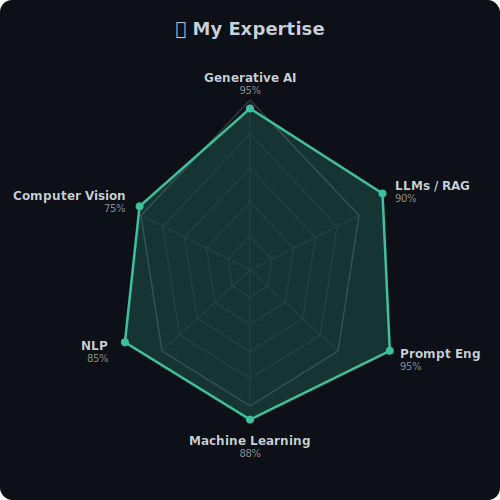

  

  
   
  
I'm <strong>John Melwin Richard</strong>, a Generative AI Engineer building intelligent systems with LLMs, RAG pipelines, and AI agents.

  
  
   
  

---

<table>
  <tr>
    <td valign="top">
      <h3>🧠 About Me</h3>
      
• Currently working on <strong>LLM-powered applications & AI agents</strong>

      
• Exploring <strong>multi-modal AI, autonomous agents & advanced RAG</strong>

      
• Ask me about <strong>Generative AI, LLMs, Prompt Engineering, RAG</strong>

      
• Background in <strong>Data Science, ML & Software Engineering</strong>

    </td>
    <td valign="top" align="center">
      
    </td>
  </tr>
</table>

---

### 🏆 Achievements

📄 [**On the Classification of Refactoring Code Reviews**](https://ieeexplore.ieee.org/document/11141041) — IEEE ICMI 2025  
🏅 [**Google Cloud Professional Cloud Architect**](https://www.credly.com/badges/b8bca8d5-2735-46b5-acd7-573f97a5b014/public_url)  
🚀 [**AIverse**](https://tryaiverse.com/) — AI hub for news, tools, prompts & more

---

### ⚒️ Tech Stack

| Category | Technologies |
|----------|-------------|
| **AI / ML Frameworks** |        |
| **Programming** |           |
| **Cloud & DevOps** |       |

---

  

